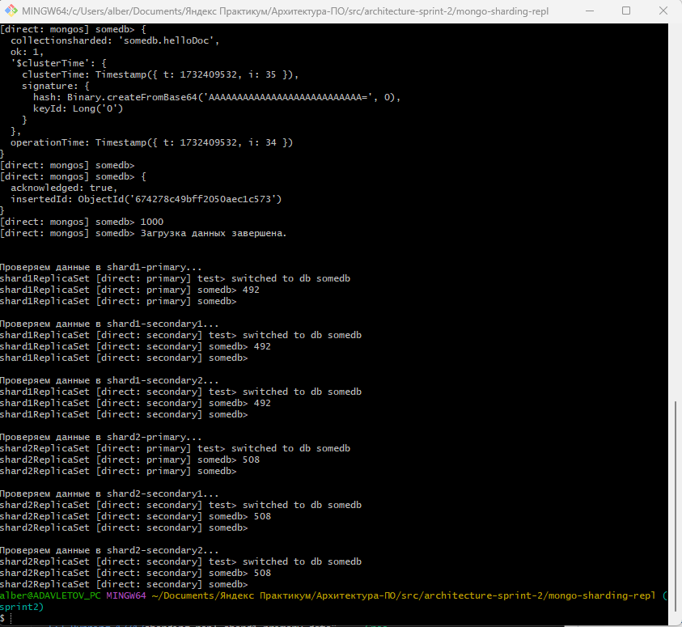

# pymongo-api

## Как запустить

Запускаем mongodb и приложение

```shell
docker compose up -d
```

Удалить докер контейнеры

```shell
docker compose down -v
```

Заполняем mongodb данными

```shell
./scripts/mongo-sharding-repl-init.sh
```

## Топология


## Проверяем данные на шардах и репликах

- Как мы видим исходные данные разделены по шардам примерно поровну. 
- Реплики каждого из шардов содержат такое же количество данных.



## Как проверить

### Если вы запускаете проект на локальной машине

Откройте в браузере http://localhost:8080

### Если вы запускаете проект на предоставленной виртуальной машине

Узнать белый ip виртуальной машины

```shell
curl --silent http://ifconfig.me
```

Откройте в браузере http://<ip виртуальной машины>:8080

## Доступные эндпоинты

Список доступных эндпоинтов, swagger http://<ip виртуальной машины>:8080/docs